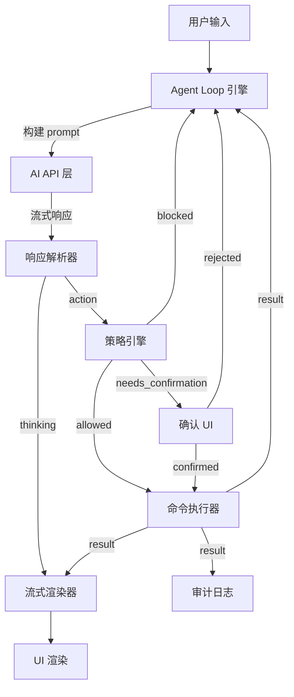
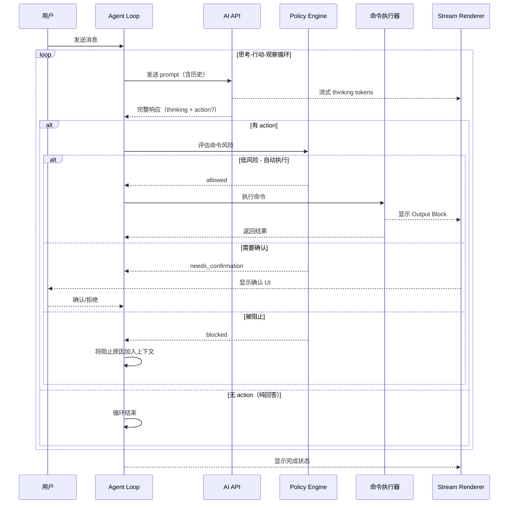

# 设计文档：统一 Agent 模式

## 概述

本设计将 NoTerm 的 AI 助手从"双模式 + 预先规划"架构重构为统一的单步执行 Agent 模式。核心变更是用"思考→行动→观察"（Think-Act-Observe）循环替代当前的"生成完整计划→逐步确认执行"流程。

**设计目标：**
- 移除 suggest_only / confirm_then_execute 模式区分
- 实现逐步执行：每次只执行一个命令，观察结果后再决定下一步
- 流式实时展示思考过程和执行结果
- 保留安全策略层和审计层
- 简化 UI，移除计划确认卡片

**关键设计决策：**
1. AI 响应采用结构化文本格式（非 JSON 计划），包含 thinking 和可选的 action 标记
2. Agent 循环作为独立模块从 XTerminal.tsx 中抽离，降低组件复杂度
3. 风险评估仍由 Policy Engine 执行，但集成到循环中而非计划确认 UI
4. UI 采用线性流式块（Thinking/Action/Output）替代计划卡片

## 架构

### 整体架构图



### Agent 循环流程



## 组件与接口

### 1. Agent Loop 引擎 (`src/terminal/agentLoop.ts`)

核心循环引擎，协调整个执行流程。

```typescript
interface AgentLoopConfig {
  sessionId: string;
  aiSettings: AiSettings;
  terminalContext: () => string;
  locale: "zh-CN" | "en-US";
  onThinkingDelta: (delta: string) => void;
  onThinkingComplete: (content: string) => void;
  onActionDecided: (action: AgentStepAction) => void;
  onActionStatusChange: (actionId: string, status: AgentActionStatus) => void;
  onOutputReceived: (actionId: string, result: AgentCommandResult) => void;
  onConfirmationNeeded: (actionId: string, action: AgentStepAction, policy: AgentPolicyDecision) => void;
  onLoopComplete: (summary: string) => void;
  onError: (error: string) => void;
  executeCommand: (command: string, timeoutSec: number) => Promise<AgentCommandResult>;
}

interface AgentLoopController {
  start(userMessage: string): void;
  stop(): void;
  confirmAction(actionId: string): void;
  rejectAction(actionId: string): void;
  isRunning(): boolean;
}

function createAgentLoop(config: AgentLoopConfig): AgentLoopController;
```

### 2. 响应解析器 (`src/terminal/agentResponseParser.ts`)

解析 AI 的结构化响应，提取 thinking 和 action。

```typescript
interface ParsedAgentResponse {
  thinking: string;
  action: AgentStepAction | null;
  done: boolean;
}

interface AgentStepAction {
  id: string;
  command: string;
  risk: AgentRisk;
  reason: string;
}

function parseAgentResponse(rawText: string): ParsedAgentResponse;
function extractStreamingThinking(partialText: string): string;
```

**AI 响应格式设计：**

AI 被指示使用以下结构化格式响应：

```
<thinking>
分析用户请求...决定需要执行什么命令...
</thinking>

<action>
{"command": "ls -la /etc", "risk": "low", "reason": "查看目录内容"}
</action>
```

或纯思考回答（无需执行命令时）：

```
<thinking>
这个问题不需要执行命令，直接回答...
</thinking>

<done/>
```

### 3. 策略引擎适配 (`src/terminal/agentPolicy.ts`)

保留现有策略评估逻辑，适配新的接口。

```typescript
// 现有接口保持不变，仅移除对 AgentAction 完整类型的依赖
interface PolicyEvaluationInput {
  command: string;
  risk: AgentRisk;
  session_id: string;
}

function evaluateCommandPolicy(
  input: PolicyEvaluationInput,
  currentSessionId: string
): AgentPolicyDecision;
```

### 4. 审计日志适配 (`src/terminal/agentAudit.ts`)

适配新的事件类型，移除对 AgentMode 和 AgentPlan 的依赖。

```typescript
type AgentAuditEvent =
  | "loop_started"
  | "step_thinking"
  | "step_action_decided"
  | "step_action_confirmed"
  | "step_action_rejected"
  | "step_action_executed"
  | "step_action_blocked"
  | "loop_completed"
  | "loop_stopped"
  | "loop_error";

interface AgentAuditRecord {
  id: string;
  ts: number;
  event: AgentAuditEvent;
  session_id: string;
  user_request?: string;
  step_index?: number;
  command?: string;
  risk?: AgentRisk;
  reason?: string;
  result?: {
    exitCode?: number;
    durationMs?: number;
    timedOut?: boolean;
    stderr?: string;
    stdout?: string;
  };
}
```

### 5. 流式渲染器 (`src/components/AgentStreamView.tsx`)

新的 React 组件，替代旧的计划卡片 UI。

```typescript
type AgentBlockType = "thinking" | "action" | "output" | "error" | "done";

interface AgentBlock {
  id: string;
  type: AgentBlockType;
  content: string;
  timestamp: number;
  // action 特有
  command?: string;
  risk?: AgentRisk;
  status?: "pending" | "running" | "success" | "failed" | "blocked" | "rejected";
  // output 特有
  exitCode?: number;
  stderr?: string;
}

interface AgentStreamViewProps {
  blocks: AgentBlock[];
  isRunning: boolean;
  pendingConfirmation: {
    actionId: string;
    command: string;
    risk: AgentRisk;
    reason: string;
  } | null;
  onConfirm: (actionId: string) => void;
  onReject: (actionId: string) => void;
  onStop: () => void;
}
```

### 6. 类型定义重构 (`src/types/agent.ts`)

```typescript
// 保留
export type AgentRisk = "low" | "medium" | "high" | "critical";
export type AgentPolicyStatus = "allowed" | "blocked" | "needs_strong_confirmation";
export type AgentActionStatus = "pending" | "confirmed" | "running" | "success" | "failed" | "blocked" | "rejected" | "timeout";

export interface AgentPolicyDecision {
  status: AgentPolicyStatus;
  reason: string;
  normalized_command: string;
  normalized_risk: AgentRisk;
}

export interface AgentCommandResult {
  exitCode: number;
  stdout: string;
  stderr: string;
  durationMs: number;
  timedOut?: boolean;
}

// 新增
export interface AgentStepAction {
  id: string;
  command: string;
  risk: AgentRisk;
  reason: string;
}

export interface AgentStep {
  index: number;
  thinking: string;
  action: AgentStepAction | null;
  actionStatus: AgentActionStatus | null;
  result: AgentCommandResult | null;
  policyDecision: AgentPolicyDecision | null;
}

export interface AgentSession {
  id: string;
  sessionId: string;
  userRequest: string;
  steps: AgentStep[];
  status: "running" | "completed" | "stopped" | "error";
  createdAt: number;
  completedAt?: number;
}

// 移除
// AgentMode, AgentPlan, AgentPlanRuntime, AgentPlanParseResult,
// AgentPlanStatus, AgentPlanActivityTone, AgentActionRuntime
```

## 数据模型

### Agent 会话状态

```typescript
interface AgentSessionState {
  // 当前会话
  currentSession: AgentSession | null;
  // UI 渲染块列表
  blocks: AgentBlock[];
  // 是否正在运行
  isRunning: boolean;
  // 待确认的动作
  pendingConfirmation: {
    actionId: string;
    command: string;
    risk: AgentRisk;
    reason: string;
    policyDecision: AgentPolicyDecision;
  } | null;
}
```

### AI 对话历史构建

每次调用 AI 时，构建的消息历史格式：

```typescript
// System prompt + 历史步骤 + 当前请求
const messages: AiMessage[] = [
  { role: "system", content: buildAgentSystemPrompt(terminalContext) },
  // 用户原始请求
  { role: "user", content: userRequest },
  // 第 1 步 AI 响应
  { role: "assistant", content: "<thinking>...</thinking>\n<action>{...}</action>" },
  // 第 1 步执行结果（作为 user 消息反馈）
  { role: "user", content: "[Command Output]\ncommand: ls -la\nexit_code: 0\nstdout: ...\nstderr: " },
  // 第 2 步 AI 响应
  { role: "assistant", content: "<thinking>...</thinking>\n<done/>" },
];
```

### 设置存储变更

```typescript
// 移除
// "ai.agentMode": "suggest_only" | "confirm_then_execute"

// 无新增设置项（Agent 模式为唯一模式，无需配置）
```

## 正确性属性

*正确性属性是在系统所有有效执行中都应成立的特征或行为——本质上是关于系统应该做什么的形式化陈述。属性是人类可读规范与机器可验证正确性保证之间的桥梁。*

### Property 1: 响应解析结构完整性

*For any* 有效的 AI 结构化响应文本（包含 `<thinking>` 标签），解析器 SHALL 正确提取 thinking 内容；当响应包含 `<action>` 标签时，SHALL 提取出包含 command 和 risk 字段的 action 对象；当响应不包含 action 标签时，SHALL 返回 action=null。

**Validates: Requirements 2.2, 2.5, 6.5**

### Property 2: 对话历史完整性

*For any* 包含 N 个已完成步骤的 Agent 会话，构建下一次 AI 调用的消息历史时，SHALL 包含所有 N 个步骤的 thinking 内容、action 内容（如有）、以及命令执行结果（包括成功输出和错误输出）。

**Validates: Requirements 2.3, 2.6, 6.3**

### Property 3: 策略评估决定执行行为

*For any* shell 命令，当 Policy_Engine 评估其为低风险（匹配只读命令前缀）时 SHALL 返回 allowed 状态；当评估为未知命令类型时 SHALL 返回 needs_strong_confirmation 状态；当评估为高风险或严重风险时 SHALL 返回 needs_strong_confirmation 状态；当匹配阻止模式时 SHALL 返回 blocked 状态。

**Validates: Requirements 4.1, 4.2, 4.3, 4.4**

### Property 4: 审计记录完整性

*For any* Agent 事件（loop_started、step_action_executed、step_action_blocked 等），Audit_Logger 生成的记录 SHALL 包含事件类型、时间戳、session_id；对于命令执行事件还 SHALL 包含 command、risk 和 result 字段；对于阻止事件还 SHALL 包含 reason 字段。

**Validates: Requirements 5.1, 5.2, 5.3**

### Property 5: 敏感信息脱敏

*For any* 包含密码模式（password=xxx）、API 密钥模式（api_key=xxx）、Bearer token 或 PEM 私钥的字符串，Audit_Logger 的脱敏函数 SHALL 将敏感值替换为 [REDACTED] 标记，且不改变非敏感部分的内容。

**Validates: Requirements 5.4**

### Property 6: 审计日志容量上限

*For any* 审计记录序列，当记录总数超过 500 时，Audit_Logger SHALL 仅保留最新的 500 条记录，且保留的记录按时间戳升序排列。

**Validates: Requirements 5.5**

### Property 7: 每步最多一个动作（不变量）

*For any* Agent 循环的单个步骤，该步骤 SHALL 包含恰好一个 thinking 块和至多一个 action 块。循环中不存在一个步骤产生多个命令执行的情况。

**Validates: Requirements 2.1, 2.2**

### Property 8: 渲染块信息完整性

*For any* AgentStepAction，渲染的 Action_Block SHALL 包含命令文本和风险等级；*For any* AgentCommandResult，渲染的 Output_Block SHALL 包含 stdout、stderr 和 exit code。

**Validates: Requirements 3.2, 3.4**

### Property 9: 渲染块时序有序性

*For any* Agent 会话产生的块序列，所有块 SHALL 按时间戳严格非递减顺序排列。

**Validates: Requirements 3.5**

### Property 10: 阻止原因反馈

*For any* 被 Policy_Engine 阻止的命令，Agent_Loop 构建的下一次 AI 调用 SHALL 在消息中包含该命令的阻止原因文本。

**Validates: Requirements 4.4**

## 错误处理

### 错误类型与处理策略

| 错误类型 | 处理方式 |
|---------|---------|
| AI API 请求失败 | 显示错误信息，停止循环，允许用户重试 |
| AI 响应解析失败 | 将原始响应作为 thinking 展示，停止循环 |
| 命令执行超时 | 记录超时，将超时信息反馈给 AI 继续循环 |
| 命令执行失败（非零退出码） | 正常流程，将错误输出反馈给 AI 自行修正 |
| 网络中断 | 显示连接错误，停止循环 |
| 用户中断（stop） | 优雅终止当前操作，标记会话为 stopped |
| 确认超时（5分钟） | 取消待确认动作，通知 AI 超时 |

### 错误恢复

- AI API 错误：用户可重新发送消息触发新循环
- 命令执行错误：AI 自动获得错误信息，可自行调整策略
- 解析错误：降级为纯文本展示，不中断用户体验

## 测试策略

### 属性测试（Property-Based Testing）

使用 `fast-check` 库进行属性测试，每个属性测试最少运行 100 次迭代。

**测试范围：**
- 响应解析器（Property 1）：生成随机结构化响应，验证解析正确性
- 对话历史构建（Property 2）：生成随机步骤序列，验证历史完整性
- 策略评估（Property 3）：生成随机命令，验证风险分类正确性
- 审计记录（Property 4, 5, 6）：生成随机事件和敏感字符串，验证记录完整性和脱敏
- 循环不变量（Property 7）：生成随机 AI 响应序列，验证每步结构
- 渲染块（Property 8, 9）：生成随机块序列，验证信息完整性和时序
- 阻止反馈（Property 10）：生成随机阻止命令，验证反馈内容

**标签格式：** `Feature: unified-agent-mode, Property N: {property_text}`

### 单元测试

- Agent Loop 状态机：测试各状态转换（idle→running→completed/stopped/error）
- 响应解析器边界情况：空响应、畸形标签、嵌套标签
- 策略引擎：已知命令前缀的分类验证
- 确认超时逻辑
- 会话管理（start/stop/new message）

### 集成测试

- AI API 层：使用 mock server 测试 OpenAI 和 Anthropic 流式响应
- 完整循环：mock AI + mock 命令执行，验证端到端流程
- UI 渲染：验证 AgentStreamView 组件正确渲染各类块

