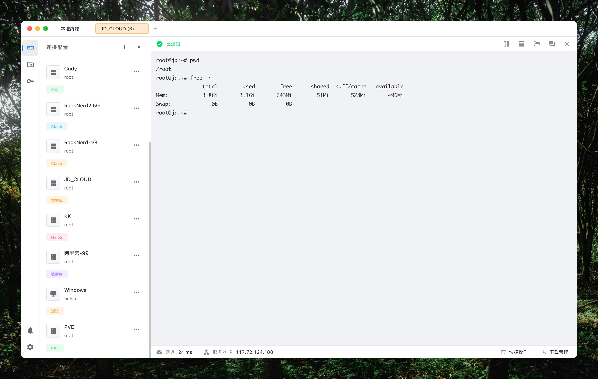
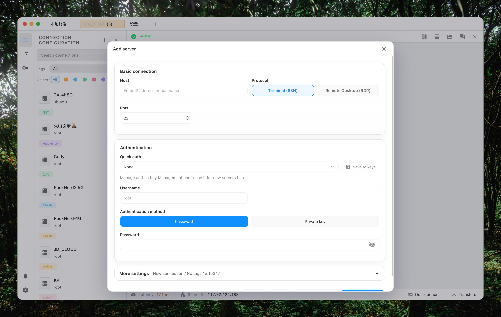
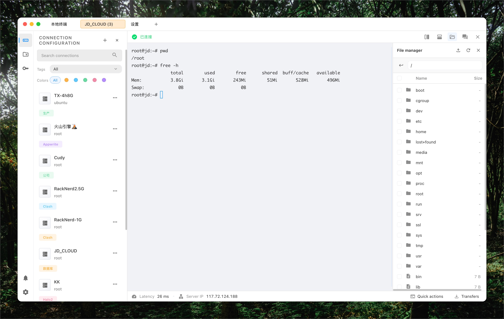
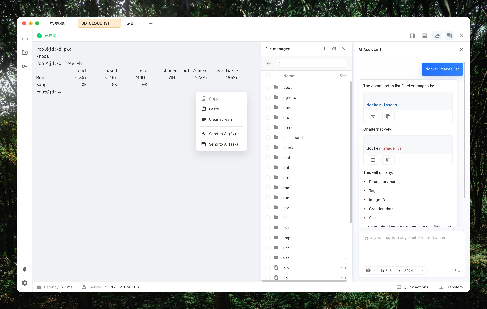

# NoTerm

A modern, friendly SSH/RDP terminal built with Tauri + React. It focuses on fast connection management, a clean terminal experience, and secure storage with a master key.

Repo: `git@github.com:NoTermTm/NoTerm.git`

## Highlights

- SSH and RDP connections in one app
- Local terminal sessions (no remote required)
- SFTP upload/download with transfer progress
- Multi-tab sessions and split terminals
- Quick auth profiles and connection presets
- Master key encryption + auto-lock
- Built-in AI assistant (OpenAI/Anthropic) with model selection
- Script snippets library and one‑click send
- Update checker via GitHub Releases (Tauri updater)
- i18n: English + Simplified Chinese

## Tech Stack

- Tauri v2
- React 19 + TypeScript + Vite
- Rust for backend commands

## Requirements

- Node.js 20+
- Rust stable toolchain
- Tauri CLI v2
- macOS or Windows (Linux not currently configured in CI)

## Quick Start

Clone:
```bash
git clone git@github.com:NoTermTm/NoTerm.git
cd NoTerm
```

Install:
```bash
npm ci
```

Dev:
```bash
npm run tauri dev
```

Build (current platform):
```bash
npm run tauri -- build
```

Build macOS Intel or Apple Silicon explicitly:
```bash
npm run tauri -- build --target x86_64-apple-darwin
npm run tauri -- build --target aarch64-apple-darwin
```

Build Windows (on Windows runner):
```bash
npm run tauri -- build --target x86_64-pc-windows-msvc
```

## Screenshots






## Installation Details

### Node.js

Use Node.js 20+.

### Rust + Tauri

Install Rust (stable) and Tauri CLI v2:
```bash
rustup default stable
cargo install tauri-cli --version "^2"
```

### macOS build prerequisites

```bash
xcode-select --install
brew install create-dmg
```

### Windows build prerequisites

- Install Visual Studio Build Tools (C++ workload)
- Install WebView2 Runtime (if not present)

## Usage Guide

### Create a connection

1. Open Connections.
2. Click “Add”.
3. Choose SSH or RDP.
4. Fill host, port, username, and auth method.
5. Save and connect.

### Use Quick Auth profiles

1. Save a working credential into Quick Auth.
2. Reuse it for new connections via the selector.

### Local terminal

Click the local session entry to open a local shell without a remote host.

### SFTP upload/download

1. Open a connected session.
2. Click the transfer button.
3. Upload or download files, view progress, and retry on failure.

### AI assistant

1. Enable AI in Settings.
2. Choose provider/model and set API key.
3. Open the AI panel in a session to ask for help or fixes.

## Signing and Auto‑Update

This project enables updater artifacts (`createUpdaterArtifacts: true`) and a public key in `src-tauri/tauri.conf.json`. That means **signing is required** during build.

Set signing keys in the environment before building updater artifacts:
```bash
export TAURI_SIGNING_PRIVATE_KEY="<your-private-key>"
export TAURI_SIGNING_PRIVATE_KEY_PASSWORD="<optional-password>"
```

If you only want a local build without updater artifacts, you can temporarily disable `createUpdaterArtifacts` in `src-tauri/tauri.conf.json`.

The update endpoint is configured in `src-tauri/tauri.conf.json` under `plugins.updater.endpoints`.

## GitHub Actions Release Flow

The workflow triggers on tag pushes (`v*`). It builds:

- macOS Apple Silicon (`aarch64-apple-darwin`)
- macOS Intel (`x86_64-apple-darwin`)
- Windows (`x86_64-pc-windows-msvc`)

All artifacts are uploaded to a single GitHub Release. Ensure these secrets exist:

- `TAURI_SIGNING_PRIVATE_KEY`
- `TAURI_SIGNING_PRIVATE_KEY_PASSWORD` (if set)

## Project Structure

- `src/` React UI
- `src/components/` UI components
- `src/pages/` App pages (Connections, Settings, Keys, Space)
- `src-tauri/` Rust backend + Tauri config
- `.github/workflows/` CI/CD workflows

## Troubleshooting

- `TAURI_SIGNING_PRIVATE_KEY` missing
  - The updater is enabled, so you must provide a private key or disable `createUpdaterArtifacts`.

- `macos-13-us-default` not supported
  - Use `macos-14`, `macos-15`, or `macos-15-intel` in GitHub Actions.

## Contributing

Issues and PRs are welcome.

### Development guidelines

- Prefer TypeScript for all new code.
- Keep UI consistent with existing design tokens and CSS patterns.
- Avoid adding new heavy dependencies unless necessary.
- Ensure new UI is accessible (keyboard focus, visible states).

### Branch & commit

- Use feature branches for non‑trivial changes.
- Write clear commit messages (imperative, concise).

### Before submitting

- Run `npm run build` to ensure TypeScript checks pass.
- Verify UI changes in both English and Chinese locales.

## License

AGPLv3

---

# 中文说明

NoTerm 是基于 Tauri + React 的现代终端应用，支持 SSH/RDP、多标签、文件传输和主密钥加密，界面清爽、响应迅速。

仓库地址：`git@github.com:NoTermTm/NoTerm.git`

## 主要功能

- SSH 与 RDP 连接
- 本地终端会话
- SFTP 上传/下载与进度管理
- 多标签会话与分屏
- 快速认证配置与连接预设
- 主密钥加密与自动锁屏
- 内置 AI 助手（OpenAI/Anthropic）及模型选择
- 脚本片段库，一键发送
- GitHub Releases 更新检测（Tauri updater）
- 中英文双语

## 技术栈

- Tauri v2
- React 19 + TypeScript + Vite
- Rust 后端命令

## 环境要求

- Node.js 20+
- Rust stable toolchain
- Tauri CLI v2
- macOS 或 Windows

## 本地运行

克隆：
```bash
git clone git@github.com:NoTermTm/NoTerm.git
cd NoTerm
```

安装依赖：
```bash
npm ci
```

开发模式：
```bash
npm run tauri dev
```

构建（当前平台）：
```bash
npm run tauri -- build
```

指定 macOS 架构构建：
```bash
npm run tauri -- build --target x86_64-apple-darwin
npm run tauri -- build --target aarch64-apple-darwin
```

## 截图


## 安装细节

### Node.js

使用 Node.js 20+。

### Rust + Tauri

安装 Rust（stable）与 Tauri CLI v2：
```bash
rustup default stable
cargo install tauri-cli --version "^2"
```

### macOS 构建依赖

```bash
xcode-select --install
brew install create-dmg
```

### Windows 构建依赖

- 安装 Visual Studio Build Tools（C++ 工作负载）
- 安装 WebView2 Runtime（若未安装）

## 使用指南

### 新建连接

1. 打开 Connections 页面
2. 点击 “Add”
3. 选择 SSH 或 RDP
4. 填写主机、端口、用户名和认证方式
5. 保存并连接

### 快速认证

1. 保存可用的认证信息到 Quick Auth
2. 在新连接中通过下拉选择复用

### 本地终端

点击本地会话即可打开本地 shell，无需远程主机。

### SFTP 上传/下载

1. 进入已连接会话
2. 点击传输按钮
3. 上传/下载并查看进度，失败可重试

### AI 助手

1. 在设置中开启 AI
2. 选择 provider 与模型并填写 API key
3. 在会话内打开 AI 面板进行问答或修复

## 更新与签名

项目开启了更新产物签名（`createUpdaterArtifacts: true`）。构建时需要设置私钥：
```bash
export TAURI_SIGNING_PRIVATE_KEY="<your-private-key>"
export TAURI_SIGNING_PRIVATE_KEY_PASSWORD="<optional-password>"
```

如果只做本地包，可临时关闭 `src-tauri/tauri.conf.json` 中的 `createUpdaterArtifacts`。

更新地址位于 `src-tauri/tauri.conf.json` → `plugins.updater.endpoints`。

## GitHub Actions 说明

打 tag（`v*`）会触发发布流程，构建以下产物并上传到同一个 Release：

- macOS Apple Silicon
- macOS Intel
- Windows

需要配置以下 Secrets：

- `TAURI_SIGNING_PRIVATE_KEY`
- `TAURI_SIGNING_PRIVATE_KEY_PASSWORD`（如有）

## 目录结构

- `src/` 前端界面
- `src/components/` 组件
- `src/pages/` 页面（连接、设置、密钥、脚本）
- `src-tauri/` Rust 后端与配置
- `.github/workflows/` CI/CD 流程

## 常见问题

- 报错 `TAURI_SIGNING_PRIVATE_KEY` 缺失
  - updater 已开启，必须提供私钥或关闭 `createUpdaterArtifacts`。

- `macos-13-us-default` 不支持
  - GitHub Actions 需改为 `macos-14`、`macos-15` 或 `macos-15-intel`。

## 贡献

欢迎提交 Issue/PR。

### 开发规范

- 新代码优先使用 TypeScript
- UI 保持与现有设计 tokens / CSS 模式一致
- 尽量避免新增重量级依赖
- 确保可访问性（键盘可操作、焦点可见）

### 分支与提交

- 非小改动建议使用功能分支
- 提交信息清晰、简洁、动词开头

### 提交前检查

- 运行 `npm run build` 确保类型检查通过
- 中英文界面都需验证显示正确

## License

项目基于AGPLv3协议开源
